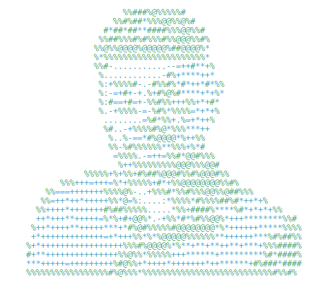

<h1 align="center">Hi, I'm Vahram Torosyan 👋</h1>

  Unity Developer • Game Developer • Junior IT Project Manager

  I build games, gameplay systems, and structured project workflows.

---

<table>
  <tr>
    <td width="100%" align="center" valign="bottom">
      <picture>
        <source media="(prefers-color-scheme: dark)" srcset="./assets/ascii-avatar-dark.svg">
        <source media="(prefers-color-scheme: light)" srcset="./assets/ascii-avatar-light.svg">
        
      </picture>
    </td>
    <td width="1000%" valign="bottom">

<pre>
vahram@github
-------------------------
Role:                 Unity Developer / Game Developer
Secondary Role:       Junior IT Project Manager
Location:             Armenia
Engine:               Unity
Languages.Code:       C#
Tools.Dev:            Git, GitHub, VS Code, Jira, Confluence
Tools.Productivity:   Notion, Miro, Figma
Focus.GameDev:        Gameplay Systems, Level Design, UI, Prototyping
Focus.PM:             Scrum, Planning, Documentation, Coordination
Currently Learning:   Project Management, Product Thinking
Interests:            2D/3D Games, Systems Design

Contact
Email:                vahram.torosyan01@gmail.com
GitHub:               github.com/van-Art
LinkedIn:             linkedin.com/in/YOUR_LINKEDIN
Telegram:             t.me/YOUR_TELEGRAM
</pre>

</td>
  </tr>
</table>

---

## About Me

- 🎮 I develop 2D and 3D games in Unity
- 🧠 I enjoy building gameplay systems, mechanics, and level flow
- 📋 I also work with planning, documentation, and team coordination
- 🚀 I am growing as both a game developer and a junior IT project manager

---

## Tech Stack

  
  
  
  
  
  
  
  
  

---

## GitHub Stats

  
  

  

---

## Current Focus

- Building Unity game projects
- Improving gameplay programming skills
- Learning stronger project management practices
- Growing a portfolio in game development and IT project management

---

## Featured Interests

- Third-person game systems
- 2D platformers
- Level design
- Pixel art game concepts
- Game documentation
- Scrum workflow

---

## Connect With Me

  <a href="https://github.com/van-Art">GitHub</a> •
  <a href="https://linkedin.com/in/YOUR_LINKEDIN">LinkedIn</a> •
  <a href="https://t.me/YOUR_TELEGRAM">Telegram</a>

